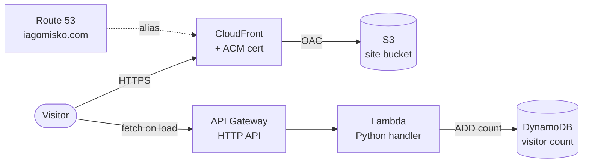

# resume-cloud-native

My resume, deployed like a production service. Built as a completed run of the
[Cloud Resume Challenge](https://cloudresumechallenge.dev/): a static site with a live
serverless visitor counter, fronted by CloudFront/HTTPS on a custom domain, entirely
defined in Terraform, deployed by two independent GitHub Actions pipelines.

**Live:** [iagomisko.com](https://iagomisko.com)

## Architecture



- **Frontend**: a single static `index.html`, no build step, no framework.
- **Visitor counter**: on page load, JS calls the API, which atomically increments
  a counter in DynamoDB and returns the new value. No unique-visitor dedup — it
  counts views, same as the original Cloud Resume Challenge design.
- **Hosting**: the site bucket is private; CloudFront reaches it exclusively through
  an Origin Access Control, never a public bucket policy.
- **Certificates**: CloudFront requires its ACM certificate to live in `us-east-1`
  specifically, regardless of the region everything else runs in (`eu-central-1`
  here). This is a hard AWS constraint, not a project choice.

## Stack

| Layer | Tech |
|---|---|
| Frontend | HTML / CSS / vanilla JS |
| API | API Gateway (HTTP API) |
| Compute | AWS Lambda (Python 3.12) |
| Database | DynamoDB |
| CDN / TLS | CloudFront + ACM |
| DNS | Route 53 |
| IaC | Terraform, S3 backend with native (lockfile-based) state locking |
| CI/CD | GitHub Actions, authenticated to AWS via OIDC (no long-lived keys) |
| Testing | pytest + moto (mocked AWS in unit tests) |

## Repo layout

```
backend/visitor_counter/     Lambda handler + pytest/moto unit tests
frontend/                    Static site (index.html + resume PDF)
infra/                       One Terraform module per concern, wired together
                              via remote state (S3 backend), not hard dependencies
  s3/                          Terraform state bucket (bootstrap; applied manually)
  dynamodb/                    Visitor counter table
  lambda/                      Counter Lambda + its IAM execution role
  api-gateway/                 HTTP API in front of the Lambda
  site/                        Private S3 bucket for site content
  cdn/                         ACM cert + CloudFront distribution + OAC
  dns/                         Route 53 zone + records for iagomisko.com
  github-oidc/                 GitHub OIDC provider + IAM role used by CI/CD
.github/workflows/
  backend-deploy.yml            Tests + terraform apply for dynamodb/lambda/api-gateway
  frontend-deploy.yml           Sync frontend/ to S3 + invalidate CloudFront
```

Each `infra/*` module follows the same file split: `providers.tf`, `backend.tf`,
`variables.tf`, `main.tf`, `outputs.tf`. Modules reference each other's outputs
via `terraform_remote_state`, so they can be applied independently as long as
the dependency order below is respected.

## CI/CD

Two independent pipelines, both authenticating via GitHub OIDC (no AWS keys stored
in the repo), both triggered only on push to `main`, scoped by path so unrelated
changes don't trigger a deploy:

- **`backend-deploy.yml`** — on changes under `backend/` or
  `infra/{dynamodb,lambda,api-gateway}/`: runs the Python test suite, then applies
  `infra/dynamodb` → `infra/lambda` → `infra/api-gateway` in that order (each
  depends on the previous one's remote state). Every apply is `terraform plan
  -out=tfplan` followed by `terraform apply tfplan` — never `-auto-approve` —
  so what gets applied is exactly what was planned.
- **`frontend-deploy.yml`** — on changes under `frontend/`: `aws s3 sync --delete`
  to the site bucket, then a CloudFront invalidation.

`infra/s3`, `infra/site`, `infra/cdn`, `infra/dns`, and `infra/github-oidc` are
bootstrap/rarely-changed infrastructure and are applied manually, not by CI.

## Local development

```bash
# run the backend tests
pip install -r backend/requirements-dev.txt
python -m pytest backend/visitor_counter/tests/ -v

# preview the frontend
open frontend/index.html
```

## Deploying from scratch

Terraform modules must be applied in dependency order, since later ones read
earlier ones' state via `terraform_remote_state`:

1. `infra/s3` — state bucket (bootstrap; this module manages its own local state)
2. `infra/dynamodb`
3. `infra/lambda`
4. `infra/api-gateway`
5. `infra/site`
6. `infra/cdn` — requires an ACM certificate for the domain, validated and
   imported into state before `terraform apply`
7. `infra/dns` — requires an existing Route 53 hosted zone, imported before apply
8. `infra/github-oidc` — unlocks the two GitHub Actions pipelines above

Each directory: `terraform init && terraform plan -out=tfplan && terraform apply tfplan`.

## Cloud Resume Challenge checklist

- [x] HTML/CSS resume
- [x] JavaScript visitor counter
- [x] Static site hosting (S3)
- [x] HTTPS (CloudFront + ACM)
- [x] DNS on a custom domain (Route 53)
- [x] Database (DynamoDB)
- [x] API (Lambda + API Gateway)
- [x] Python backend logic + unit tests
- [x] Infrastructure as Code (Terraform)
- [x] Source control (GitHub)
- [x] CI/CD, backend
- [x] CI/CD, frontend
- [x] Blog post — replaced with this README
